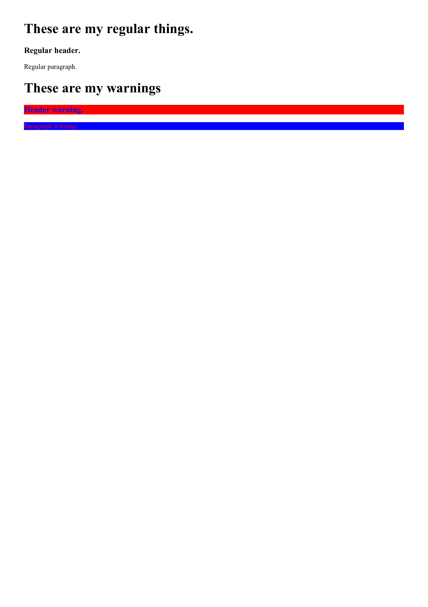

# Class Selectors on Elements

Rules can be specified for only elements that have a particular
class by appending the class name to the element name with a dot.

---

### CSS
```CSS
h3.warning {
  color: blue;
  background: red;
}

p.warning {
  color: red;
  background: blue;
}

```

---

### HTML
```HTML
<!DOCTYPE html>
<html>
  <head>
    <title>Page Title</title>
    <link rel="stylesheet" href="style.css" />
  </head>
  <body>
    <h1>
      These are my regular things.
    </h1>
    
    <h3>
      Regular header.
    </h3>
    
    <p>
      Regular paragraph.
    </p>
    
    <h1>
      These are my warnings
    </h1>
    
    <h3 class="warning">
      Header warning.
    </h3>
    
    <p class="warning">
      Paragraph warning.
    </p>
  </body>
</html>

```

---

### Example


